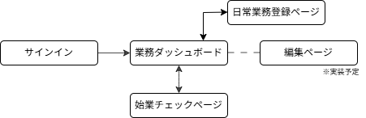
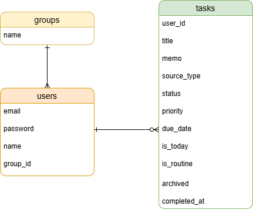

# Director’s Assistant

## 概要

Director’s Assistantは、日常業務と突発的に発生する単発タスクを一元管理できるTODO管理アプリケーションです。

複数のチャネル（メール・チャット・口頭）に分散しがちな業務指示を集約し、「誰が・何を・いつまでに対応するのか」を可視化することで、業務の抜け漏れ防止と心理的負担の軽減を目的としています。

Ruby on Rails の標準機能とHotwireを活用し、シンプルかつ高速な操作体験を実現しています。

---

## 開発背景

前職の不動産会社にて、業界全体のDX推進に伴うシステムリプレイスを経験しました。
しかし、デジタル化を進めていく中で通常業務に加え単発業務は増え、指示系統はメール・チャット・口頭と多角化し、現場のタスクは断片化されていきました。
この課題に対処するため、業務効率化を目的にSharePointを用いたタスク管理ツールを自ら設計・構築し、チームへ導入しました。

導入当初は一定の効果があったものの、

* 入力項目の多さによる運用負荷
* 画面構造の複雑さによる視認性の低下、ミーティング時間の増加
* メール・チャット・口頭など複数チャネルからの指示の集約が困難

といった課題が徐々に顕在化しました。

その結果、「誰が何を抱えているのか」が完全には可視化されず、タスク管理が形骸化する場面も見られました。

これらの課題を踏まえ、

**「現場で本当に使われ続けるためには何が必要か」**を再定義し、
「思考を止めずに即座に記録できること」に特化したタスク管理アプリとして本アプリを開発しました。

---

## 主な機能

* タスクの作成・編集・削除
* 爆速登録機能（最小入力でタスク登録）
* ユーザー認証機能（Devise）
* 非同期更新による高速UI（Hotwire）

---

## 技術スタック

### バックエンド

* Ruby 3.2.0
* Ruby on Rails 7.1

### フロントエンド

* Hotwire（Turbo / Stimulus）
* Importmap（Node.jsを使用しない構成）
* Sprockets

### データベース

* Development / Test: MySQL
* Production: PostgreSQL

### サーバー

* Puma

### 認証

* Devise

### テスト

* RSpec
* Capybara
* Selenium

---

## 工夫したポイント

### 1. 思考を止めないUI/UX設計

業務中の認知負荷を最小化するため、入力の手間を徹底的に削減しました。

* 画面遷移を伴わないインライン入力
* 必要最小限の項目で登録可能な設計
* Turboによる非同期更新でストレスのない操作感

タスク記録の心理的ハードルを下げ、継続的に使える設計としています。

---

### 2. Hotwireを用いた軽量SPA体験の実現

React等のフロントエンドフレームワークを使用せず、Hotwireを採用しました。

* サーバーサイド中心の構成で複雑性を抑制
* ページリロードなしの高速な画面更新
* 保守性と開発効率の両立

---

### 3. テストによる品質担保

RSpecを用いたSystem Specを中心にテストを実装しています。

* タスクのCRUD機能
* 認証制御
* Turboを含む非同期処理の検証

リファクタリング時の安全性を確保しています。

---

### 4. 業務ドメインを意識したデータ設計

不動産業務の特性を踏まえ、

* 日常業務（Routine）
* 単発タスク

を同一テーブル内で区別できる設計を採用しました。

実務での運用を意識した構造としています。

---

## 画面遷移図
 

---

## ER図


---
## セットアップ

```bash
bundle install
bin/rails db:create
bin/rails db:migrate
```

---

## 起動方法

```bash
bin/rails s
```

---

## アクセス

ブラウザで以下にアクセスしてください。
http://localhost:3000 にアクセス

---

## テスト

```bash
bundle exec rspec
```

---

## 今後の実装予定

* 優先度管理機能（A/B/Cの3段階）
* タスク詳細編集機能の拡張
* 自然言語処理によるタスク自動生成
* チーム共有機能（グループ機能）

---

## URL

(https://director-assistant-2.onrender.com)

---

